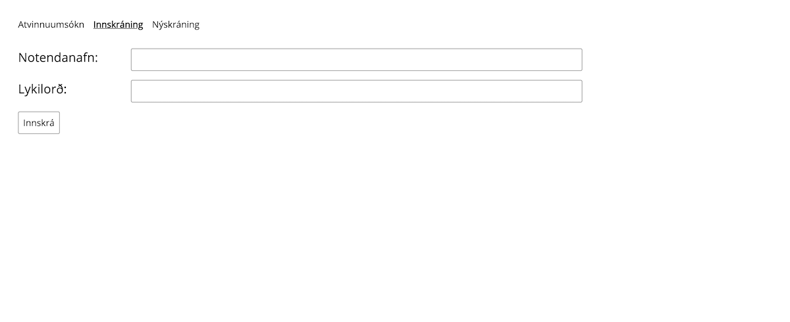
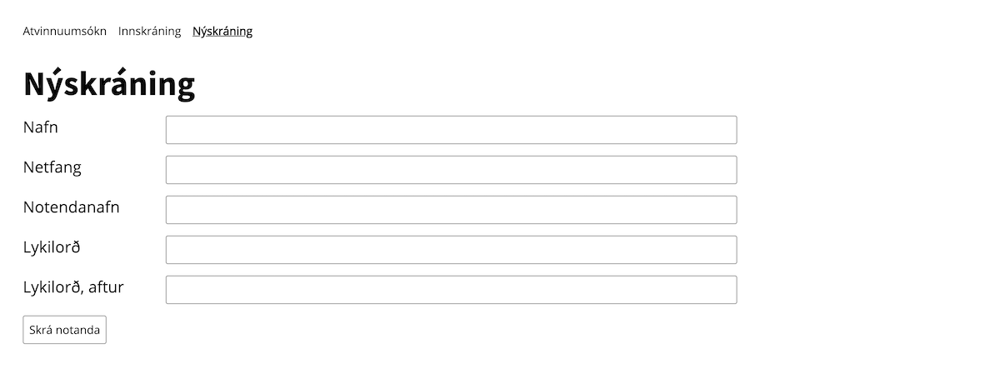
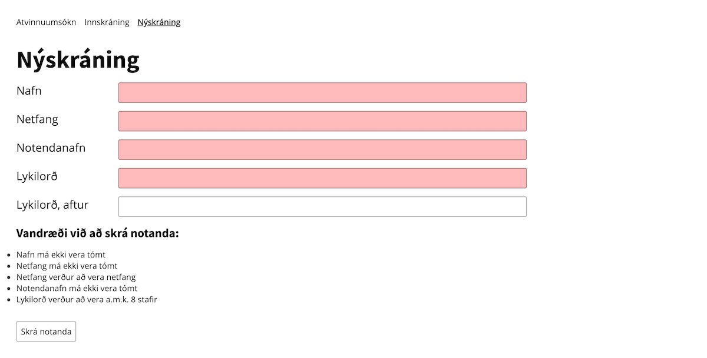
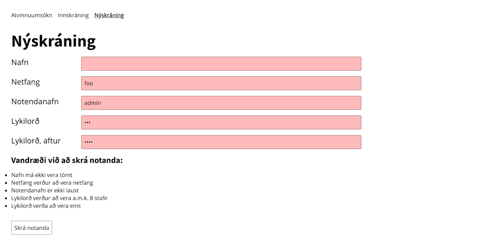
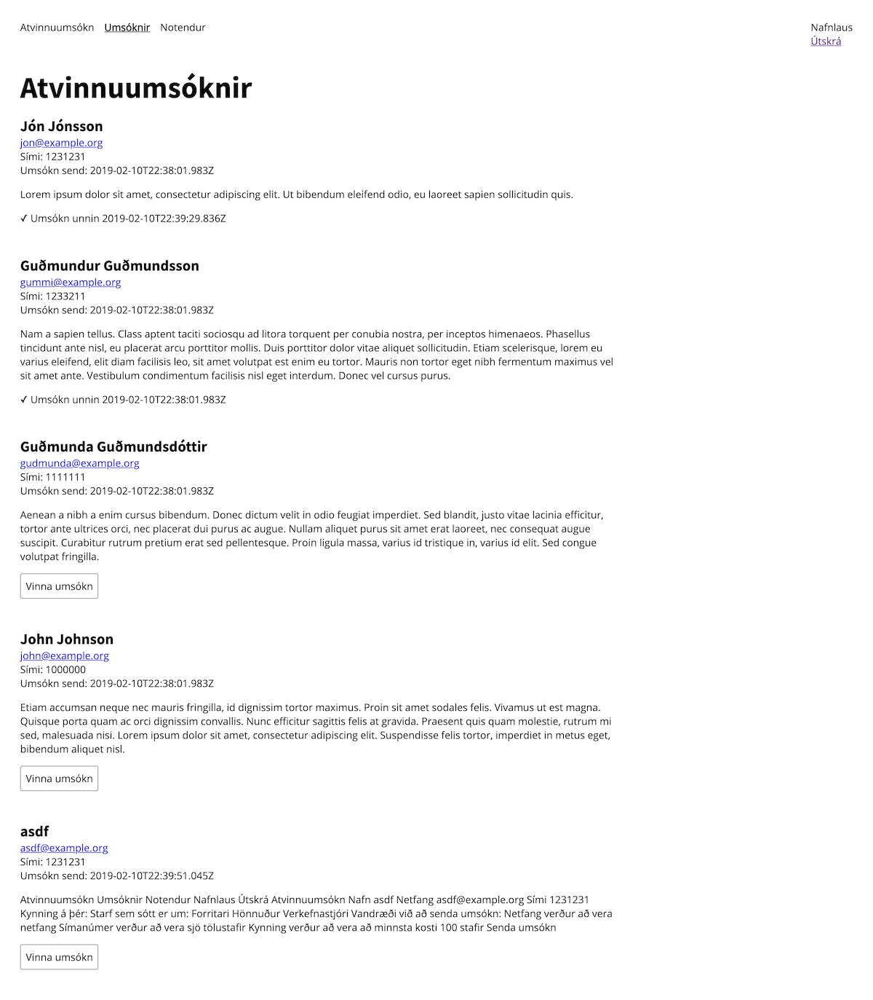
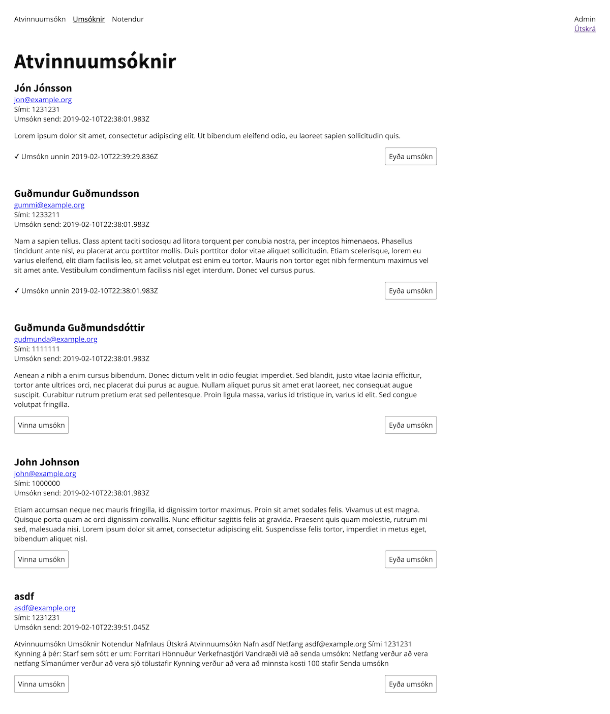
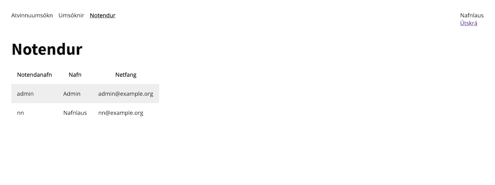
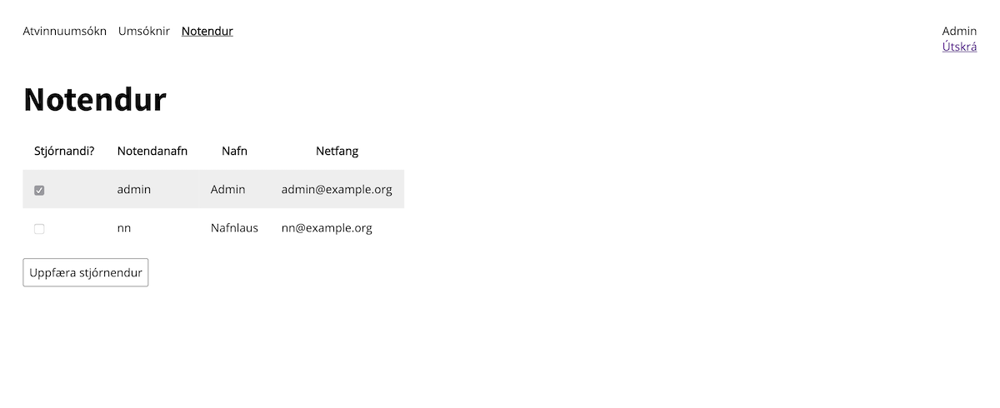
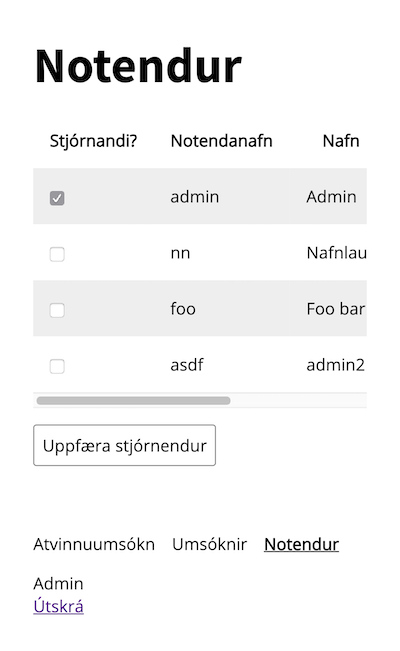

# Gefið útlit

> Innskráning

> Nýrkskráning

> Nýskráning með villum

> Nýskráning með villum

> Umsóknir, ekki admin

> Umsóknir, admin

> Notendur, ekki admin

> Notendur, admin

> Notendur, admin, 400px

